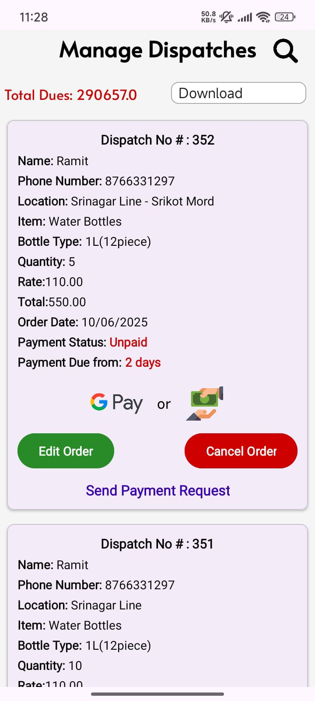

# 🧴 Bottle Management App (HillWater)

An Android app designed for small businesses to manage bottle inventory, customer dues, and payment tracking. Built using **Java**, **Firebase Realtime Database**, and **Android Studio**.

---

## 📱 Features

- 🔍 View unpaid invoices with total dues
- 📆 Filter records by date or customer
- ☁️ Data stored and synced in real-time using Firebase
- 🧾 Export filtered invoices as Excel
- 📞 Search/filter by phone number
- 🔐 Login system with Firebase Auth
- ✅ Lightweight, fast, and built for real-world business usage

---

## 🛠️ Built With

- **Java**
- **Firebase Realtime Database**
- **Firebase Authentication**
- **Android Studio**

---

## 📸 Screenshots

🧾 Home Screen

📥 Invoice List

📤 Paid/Unpaid Filter

📦 Bottle Stock

🔄 Manage Requests

🧮 Stock Records

💧 Splash Screen

---

## 👤 Author

**Karan Rana**  
📧 [krn.rna.2003@gmail.com]  
📱 Built with ❤️ for real-world business needs

---

## 🧳 Use Case

Originally built for a family-owned water delivery business to track bottle deposits and dues across customers. Can be extended into a full invoice and logistics management solution.

---

